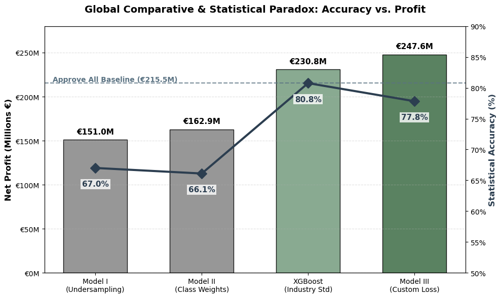
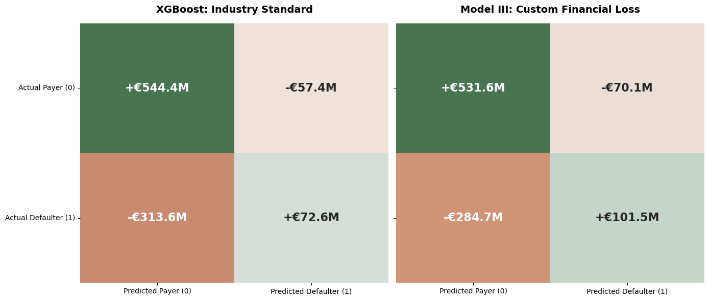
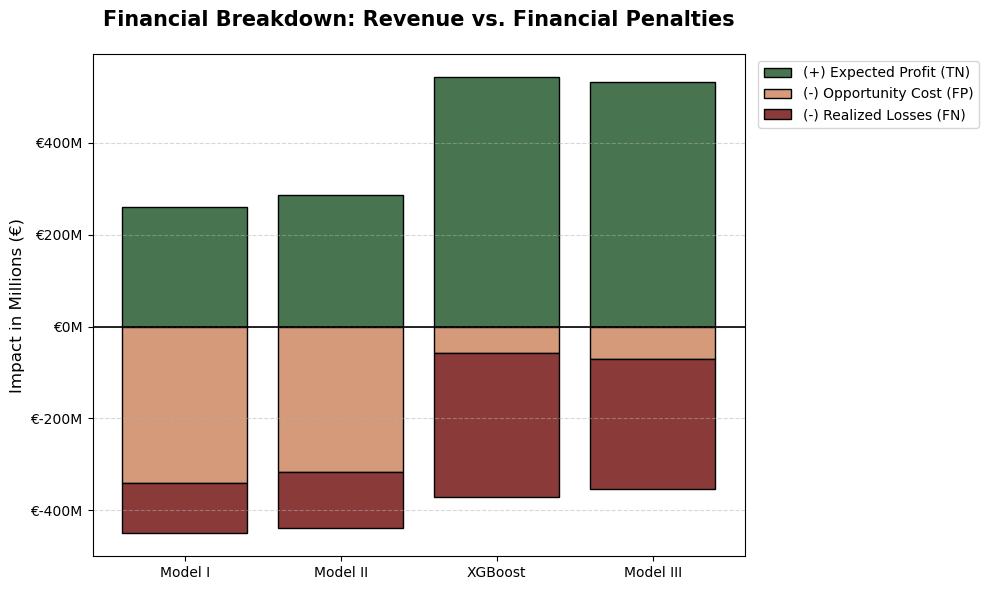

# Predictive Modeling of Loan Defaults in the Banking Sector using Artificial Neural Networks

[](https://www.python.org/)
[](https://www.tensorflow.org/)
[](LICENSE)
[](https://etseib.upc.edu/)

> **Bachelor's Thesis (TFG)** — *Degree in Industrial Technology Engineering & Economic Analysis (GTIAE)*  
> **ETSEIB — Universitat Politècnica de Catalunya (UPC) & Universitat Pompeu Fabra (UPF)**  
> **Author:** Eduard Gibert Font  
> **Supervisors:** Prof. Yolanda Bolea Monte, Prof. Antoni Grau Saldes  
> **Call:** June 2026

---

## Abstract

In the banking sector, credit scoring has traditionally been approached using linear models that prioritize statistical metrics over actual net profit. This study addresses the problem of optimizing artificial intelligence models applied to credit risk, with the goal of maximizing financial profitability. 

To this end, a Multi-Layer Perceptron (MLP) neural network was designed and implemented on the public Lending Club dataset, which originally contained over 2.2 million loans. The study develops a structured methodology that compares three different training strategies: a baseline model with undersampling, a model with probability-based class weights, and finally, a model optimized using a custom financial loss function that incorporates actual cash flows (French Amortization, Loss Given Default or LGD, and Cost of Funds). 

The results show that **Model III (customized loss function) achieves a net profit of 247.6 million euros**, outperforming the industry standard (**XGBoost**) by **17 million euros** and a full approval scenario by **32.1 million euros**. The main conclusion demonstrates that capital-based optimization, rather than traditional statistical accuracy, is the optimal approach for maximizing bank profitability.

---

## Motivation: The Meeting Point Between AI and Finance

The main reason behind this research is the gap between how data science models are commonly evaluated and how financial institutions really operate. In standard machine learning, algorithms aim to improve statistical measures like Accuracy or the Area Under the ROC Curve (AUC). While this method is mathematically valid, it treats all classification mistakes the same:

> *Financial institutions deal with capital, not just probabilities. A misclassification on a small loan does not impact the economy the same way a default on a large mortgage does, yet standard loss functions treat both scenarios equally. Traditional loss functions such as Binary Cross-Entropy face a fundamental limitation when confronted with real-world credit scoring: their focus on probabilities leads to unrealistic simplifications, such as treating a €500 default the same as a €50,000 one.*

In the banking sector:
- **Approving a high-risk borrower who defaults** leads to a significant capital loss (unrecovered principal, lost recovery expenses, and Cost of Funds).
- **Wrongly rejecting a reliable customer** only results in a smaller opportunity cost (the lost interest margin).

This project shifts the focus from statistical improvement to direct profit maximization using cost-sensitive learning approaches.

---

## The Statistical Paradox: Accuracy vs. Profit

Before evaluating the economic impact of the Custom Loss Function, the statistical behavior of the architectures was benchmarked against **XGBoost** (the industry standard):

| Metric | XGBoost (Industry Std.) | Model III (Custom Financial Loss) |
| :--- | :---: | :---: |
| **Loss** (Cross-Entropy / Log-Loss) | 0.5040 | **0.1778** |
| **Accuracy** | **0.8076** | 0.7783 |
| **AUC-ROC** | **0.7345** | 0.6765 |
| **AUC-PR** | **0.4061** | 0.3352 |
| **Precision** | **0.5512** | 0.4005 |
| **Recall (Sensitivity)** | 0.1442 | **0.2150** |

As expected, tree-based XGBoost achieved higher Accuracy (80.76%) and Precision (55.12%) on imbalanced data. However, this apparent robustness hid an extremely passive behavior: its **Recall of just 0.1442** indicates that the model was statistically ignoring more than 85% of the minority class to protect its accuracy score.

In contrast, **Model III** exhibited a much more strategic behavior:
- By dynamically weighting the gradients based on financial impact, the network learned to focus its predictive capacity on the most expensive, capital-draining profiles.
- It achieved a significantly higher Recall (0.2150) than XGBoost without falling into the extreme risk aversion of undersampling models.
- While its statistical Precision dropped to 40.05% and Accuracy experienced a slight decline to 77.83%, it assumed False Positives specifically on smaller, less profitable loans.

In traditional data science, this degradation in statistical metrics might justify discarding Model III. However, evaluating the direct economic impact proves that **maximizing pure statistical accuracy does not equate to maximizing capital**.

---

## Global Comparative Analysis & Banking P&L

All strategies were evaluated on an isolated out-of-time test set of **240,111 loans** using cash-flow accounting based on the French Amortization System:

| Model / Strategy | Strategy Type | Training Set | Primary Objective | Opportunity Cost (FP) | Realized LGD (FN) | Net Profit (€) | vs. Benchmark |
| :--- | :--- | :--- | :--- | :---: | :---: | :---: | :---: |
| **Approve All** | Naive Baseline | None | Baseline | **€0.0M** | €421.3M | €215.5M | -€15.2M |
| **Model I (Undersampling)** | MLP (256-128-64) | ~380k (50/50) | Balanced BCE / Max F1 | €340.5M | **€110.3M** | €151.0M | -€79.7M |
| **Model II (Class Weights)** | MLP (256-128-64) | ~960k (80/20) | Weighted BCE / Max F1 | €316.1M | €122.7M | €162.9M | -€67.8M |
| **XGBoost** | Gradient Boosting | ~960k (80/20) | Log-Loss (BCE) | €35.2M | €313.6M | €230.7M | Benchmark |
| **Model III (Custom Loss)** | **MLP (256-128-64)** | **~960k (80/20)** | **Capital / Max Profit** | **€70.1M** | **€284.7M** | **€247.6M** | **+€16.9M (+7.3%)** |

<p align="center">
  
</p>

### Key Economic Takeaways

1. **The Cost of Risk Aversion:** In Models I and II, symmetric loss functions forced the network to identify defaulters indiscriminately (Recall > 0.67). While their False Negative losses were lower, they destroyed massive business value through **€340.5M and €316.1M in Opportunity Cost** (wrongly rejecting creditworthy borrowers). Both underperformed the naive "Approve All" baseline.
2. **XGBoost Permissiveness:** Conversely, XGBoost became excessively permissive to avoid harming its accuracy, allowing a large volume of high-risk profiles to slip through, resulting in **€313.6 million in actual losses**.
3. **Model III Balance:** Under the premise that a euro lost to default penalizes more than a euro not earned by rejecting a loan, Model III adjusted its threshold to protect core capital. It reduced actual losses to €284.7M (saving over €28.9M compared to XGBoost), while keeping opportunity cost to €70.1M.

> *Model III outperformed the other candidates not because it is the most accurate, but because it makes the most affordable mistakes.*

<p align="center">
  
</p>

<p align="center">
  
</p>

---

## Financial Methodology & Custom Loss Formulation

### 1. French Amortization & Expected Profit

To calculate the money the bank receives from a paying borrower versus what it costs to maintain the loan, the French Amortization System (constant monthly installments) was modeled. For a loan with principal $P$ (`loan_amnt`), annual interest rate $I$ (`int_rate`), and duration $n = \text{term}$ (months), the monthly installment $PMT$ is:

$$PMT = P \cdot \frac{r(1+r)^n}{(1+r)^n - 1}$$

where $r = \frac{I}{1200}$ is the monthly interest rate. The gross expected interest is:

$$\text{Expected Interest} = (PMT \cdot n) - P$$

Accounting for the **Cost of Funds (CoF)** at an annualized wholesale funding rate of $c = 3.0\%$ ($r_{\text{CoF}} = \frac{0.03}{12}$):

$$PMT_{\text{CoF}} = P \cdot \frac{r_{\text{CoF}}(1+r_{\text{CoF}})^n}{(1+r_{\text{CoF}})^n - 1}$$

$$\text{Expected CoF} = (PMT_{\text{CoF}} \cdot n) - P$$

$$\text{Expected Profit} = \text{Expected Interest} - \text{Expected CoF}$$

### 2. Realized Loss Given Default ($\text{LGD}$)

Realized LGD was computed from actual recovery cash flows:

$$\text{Cash In} = \text{Rec. Principal} + \text{Rec. Interest} + \text{Late Fees} + (\text{Recoveries} - \text{Collection Fees})$$

$$\text{months active} = \min\left(n, \max\left(0, \frac{\text{total pymnt}}{PMT}\right)\right)$$

$$\text{Cash Out} = P + \text{Expected CoF} \cdot \frac{\text{months active}}{n}$$

$$\text{Real LGD} = \max(0, \text{Cash Out} - \text{Cash In})$$

*(Clipped at zero to ensure that if the bank recovered more than the principal plus funding costs, the loss is fixed to 0).*

### 3. Custom Financial Loss Function

To embed these cash flows directly into backpropagation without gradient explosion, costs were normalized by the average loan amount ($\bar{P} = \text{mean loan} \approx €15,000$):

$$\mathcal{L}_{\text{Financial}}(\mathbf{y}_{\text{ext}}, \hat{p}) = -\frac{1}{N} \sum_{i=1}^{N} \left[ y_i \cdot \frac{\text{Real LGD}_i}{\bar{P}} \cdot \log(\hat{p}_i) + (1 - y_i) \cdot \frac{\text{Expected Profit}_i}{\bar{P}} \cdot \log(1 - \hat{p}_i) \right]$$

where $\mathbf{y}_{\text{ext}} = \left[ y_i, \frac{\text{Real LGD}_i}{\bar{P}}, \frac{\text{Expected Profit}_i}{\bar{P}} \right]$ is packaged into a 3-column target tensor.

---

## Repository Structure

```
credit-default-prediction/
│
├── README.md                           <- Project overview, financial formulas, and thesis results
├── requirements.txt                    <- Python library dependencies
├── .gitignore                          <- Git rules excluding large raw datasets
├── LICENSE                             <- MIT License
│
├── src/                                <- Clean modular Python scripts (from Thesis Appendix A)
│   ├── 01_data_cleaning.py             <- Pipeline: filtering, leakage removal, encoding, 80/20 split
│   ├── 02a_pipeline_mice_balanced.py   <- MICE imputation + RandomUnderSampler (50/50 balance)
│   ├── 02b_pipeline_median_flags.py    <- Median imputation benchmark with missingness indicators
│   ├── 02c_pipeline_imbalanced.py      <- Full 80/20 natural distribution pipeline (no undersampling)
│   ├── 03_financial_extraction.py      <- Cash-flow extraction, French Amortization & Real LGD
│   ├── 04_model_1_baseline_undersampling.py <- Baseline MLP with BCE on balanced data
│   ├── 05_model_2_class_weights.py     <- Cost-Sensitive MLP with balanced class weights
│   ├── 06_model_3_custom_financial_loss.py  <- Profit-Driven Custom Loss MLP (EDCSL)
│   └── utils_financial_evaluation.py   <- Banking P&L evaluation & financial confusion matrix
│
├── notebooks/                          <- Interactive production notebooks from development
│   ├── 01_PIPELINE_UNDERSAMPLING_AND_MICE.ipynb
│   ├── 02_PIPELINE_FULL_8020.ipynb
│   ├── 03_FINANCIAL_EXTRACTION.ipynb
│   └── COMPARATIVE_GRAPHS.ipynb        <- Generates publication figures
│
└── figures/                            <- High-resolution plots from thesis
    ├── CONFUSION_MATRIX_MODEL_1.png
    ├── CONFUSION_MATRIX_MODEL_2.png
    ├── CONFUSION_MATRIX_COMPARISON.png
    ├── NET_PROFIT_COMPARISON.png
    ├── STACKED_BAR.png
    └── GRAPH_FINAL.png
```

---

## Quickstart & Replication

### 1. Requirements

Install required dependencies:

```bash
git clone https://github.com/your-username/credit-default-prediction.git
cd credit-default-prediction
pip install -r requirements.txt
```

### 2. Dataset Acquisition

The dataset used in this study is the **Lending Club Loan Data (2007–2018Q4)**:
- Available on Kaggle: [Lending Club Dataset (wordsforthewise)](https://www.kaggle.com/datasets/wordsforthewise/lending-club)
- Place `accepted_2007_to_2018Q4.csv` inside a local `data/` folder.

### 3. Pipeline Execution

Run the complete pipeline from raw data to economic evaluation:

```bash
# Step 1: Preprocessing & leakage removal
python src/01_data_cleaning.py --input data/accepted_2007_to_2018Q4.csv --output data/processed_raw

# Step 2: Build the full imbalanced dataset
python src/02c_pipeline_imbalanced.py --input_dir data/processed_raw --output_dir data/full_8020

# Step 3: Extract financial cash flows (French Amortization & Real LGD)
python src/03_financial_extraction.py --raw_csv data/accepted_2007_to_2018Q4.csv --output_dir data/finance

# Step 4: Train Model III (Custom Financial Loss) and optimize net profit
python src/06_model_3_custom_financial_loss.py --data_dir data/full_8020 --finance_dir data/finance
```

---

## Citation

```bibtex
@thesis{gibert2026predictive,
  author       = {Eduard Gibert Font},
  title        = {Predictive Modeling of Loan Defaults in the Banking Sector using Artificial Neural Networks},
  school       = {Universitat Politècnica de Catalunya (UPC) \& Universitat Pompeu Fabra (UPF)},
  year         = {2026},
  type         = {Bachelor's Thesis},
  address      = {Barcelona, Spain}
}
```

---

## License

This project is licensed under the MIT License — see the [LICENSE](LICENSE) file for details.
